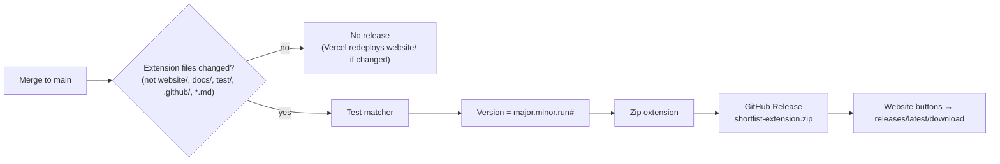

# Release pipeline

Which merges publish a new extension version, and how the website always serves the latest zip.

```mermaid
flowchart LR
  M["Merge to main"] --> Q{"Extension files changed?<br/>(not website/, docs/, test/, .github/, *.md)"}
  Q -- no --> N["No release<br/>(Vercel redeploys website/ if changed)"]
  Q -- yes --> T["Test matcher"] --> V["Version = major.minor.run#"] --> Z["Zip extension"] --> R["GitHub Release<br/>shortlist-extension.zip"]
  R --> W["Website buttons → releases/latest/download"]
```

[← All diagrams](README.md) · [← Project README](../../README.md)
