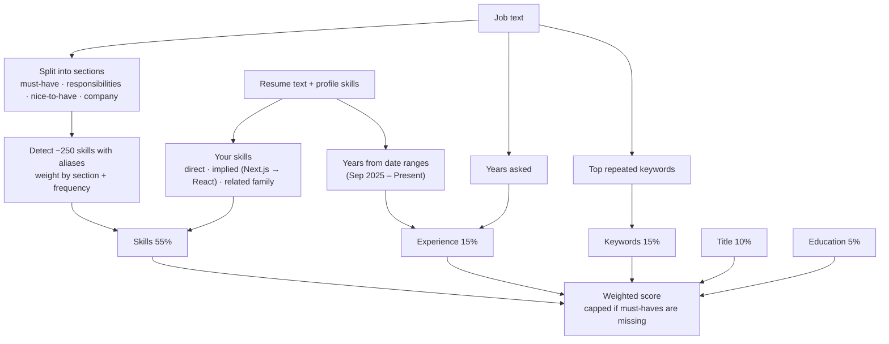

# How the match score is calculated

The score is deterministic — no AI. Same resume + same job = same score.

```mermaid
flowchart TD
  JD["Job text"] --> SEC["Split into sections<br/>must-have · responsibilities · nice-to-have · company"]
  SEC --> SK["Detect ~250 skills with aliases<br/>weight by section + frequency"]
  RES["Resume text + profile skills"] --> HAVE["Your skills<br/>direct · implied (Next.js → React) · related family"]
  SK & HAVE --> S1["Skills 55%"]
  JD --> Y["Years asked"] --> S2["Experience 15%"]
  RES --> YR["Years from date ranges<br/>(Sep 2025 – Present)"] --> S2
  JD --> KW["Top repeated keywords"] --> S3["Keywords 15%"]
  S4["Title 10%"]
  S5["Education 5%"]
  S1 & S2 & S3 & S4 & S5 --> SCORE["Weighted score<br/>capped if must-haves are missing"]
```

[← All diagrams](README.md) · [← Project README](../../README.md)
